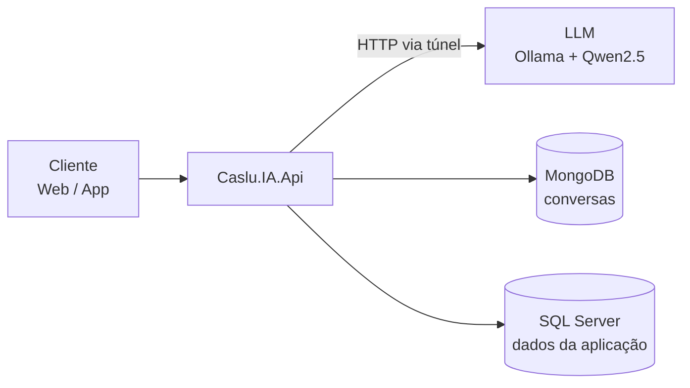
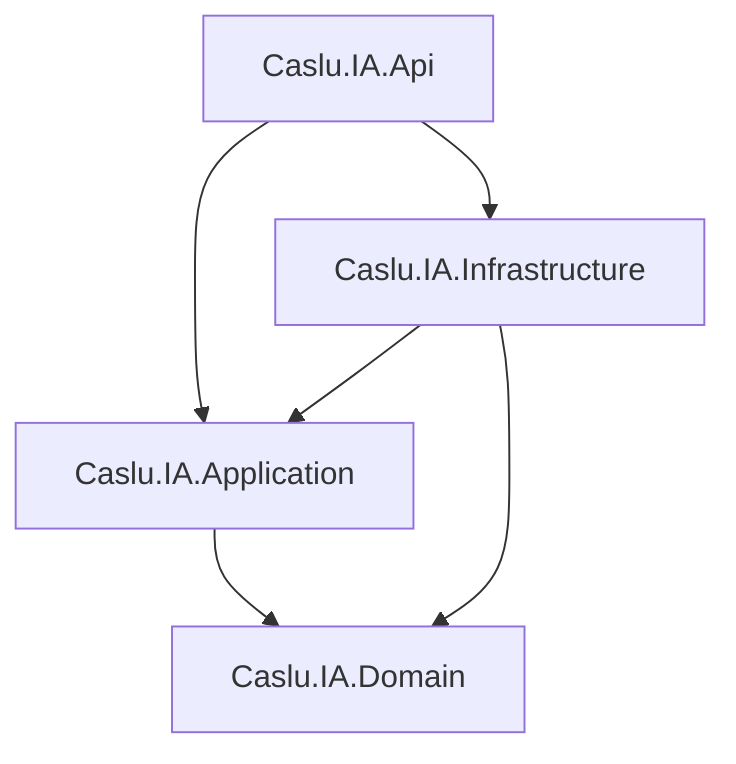

# Caslu IA


API da **IA corporativa da CASLU TECNOLOGIA**: um chatbot inteligente, com contexto persistente, usando uma LLM open source self-hosted e integrado aos dados da empresa.

---

## 📐 Arquitetura



### Camadas



| Projeto | Responsabilidade | Depende de |
|---|---|---|
| `Caslu.IA.Domain` | Entidades e regras de domínio | — |
| `Caslu.IA.Application` | Casos de uso e interfaces (contratos) | Domain |
| `Caslu.IA.Infrastructure` | Implementações: MongoDB, cliente da LLM, SQL Server | Application, Domain |
| `Caslu.IA.Api` | Controllers, configuração e composição (DI) | Application, Infrastructure |

---

## 🧭 Princípios

1. A LLM **nunca** acessa bancos de dados diretamente.
2. Toda ação passa pela API.
3. A LLM apenas **propõe** tools (function calling); a API **valida e executa**.
4. O histórico das conversas pertence à aplicação (MongoDB), não à LLM.

---

## 🧰 Pré-requisitos (desenvolvimento)

- [.NET 8 SDK](https://dotnet.microsoft.com/download/dotnet/8.0)
- Acesso ao túnel **WireGuard** do projeto (MongoDB em `10.10.0.1`)
- Túnel SSH para a LLM, expondo o Ollama em `localhost:11434`:

```powershell
ssh -L 11434:10.10.0.6:11434 root@<IP-publico-ubuntu>
```

---

## ⚙️ Configuração

Valores não sensíveis ficam no `appsettings.json`. Segredos ficam **somente** no User Secrets:

```powershell
dotnet user-secrets set "MongoDb:ConnectionString" "mongodb://api_ia:<senha>@10.10.0.1:27017/ia_corporativa?authSource=ia_corporativa" --project src/Caslu.IA.Api
```

| Chave | Onde | Descrição |
|---|---|---|
| `MongoDb:ConnectionString` | User Secrets | Conexão com o MongoDB (usuário `api_ia`) |
| `MongoDb:DatabaseName` | `appsettings.json` | Banco das conversas (`ia_corporativa`) |
| `Ollama:BaseUrl` | `appsettings.json` | URL da LLM (`http://localhost:11434` em dev) |
| `Ollama:Model` | `appsettings.json` | Modelo utilizado (`qwen2.5:3b`) |
| `Ollama:TimeoutSeconds` | `appsettings.json` | Tempo máximo de resposta da LLM |

> [!NOTE]
> A API valida as configurações na inicialização e **não sobe** se algum valor obrigatório estiver faltando.

---

## ▶️ Como executar

```powershell
dotnet build
dotnet run --project src/Caslu.IA.Api
```

---

## 📁 Estrutura

```
Caslu.IA/
├── src/
│   ├── Caslu.IA.Api/
│   ├── Caslu.IA.Application/
│   ├── Caslu.IA.Domain/
│   └── Caslu.IA.Infrastructure/
├── CHANGELOG.md
├── CLAUDE.md
├── Caslu.IA.sln
└── README.md
```

---

## 🗺️ Roadmap

- [ ] Chatbot com histórico persistente
- [ ] Tools (function calling)
- [ ] RAG com o conhecimento do negócio
- [ ] Entendimento do estado da operação
- [ ] Projeções e tendências
- [ ] Agentes proativos

---

## 📚 Documentação

- Regras de desenvolvimento: [CLAUDE.md](CLAUDE.md)
- Histórico de mudanças: [CHANGELOG.md](CHANGELOG.md)
- Infraestrutura (WireGuard, Ollama, MongoDB, segurança): repositório `Caslu_IA-Corporativa`

---

## 🔒 Segurança

> [!WARNING]
> Nunca versionar senhas, connection strings com senha, tokens ou chaves privadas.

---

© CASLU TECNOLOGIA — Repositório privado.
